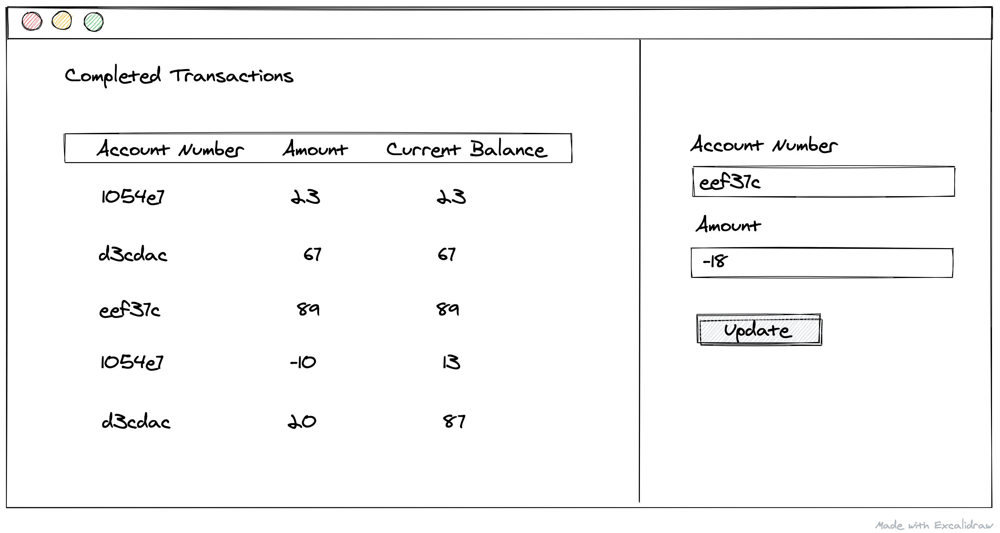

# Interview Assignment: Account Management Frontend - Level 1

Hi there! 👋

In this interview assignment, your task is to build a frontend for the [Account Management API](api-specification.yml) service.

See the mockup below to get the idea of how it should look.



Feel free to tweak the UI but please make sure it covers the following:

1. There's a form with an `Account ID` and `Amount` fields. Whenever the form is submitted, the data should be sent on the server.
2. There's a list of the previously submitted transactions. The transaction info should include the corresponding `Account ID`, `Amount`, and the account `Balance` at the submission time.
3. On a full page-reload, the transaction list should include all previously submitted transactions.
4. A transaction should appear at the top of the list right when it was submitted.

## What's included 🗂
We've added the [Account Management API](api-specification.yml) specification defined in the Open API format, as well as a backend service that implements this API.

Please use the provided backend to verify that your frontend app works as expected.

To spin it up locally, run:
```
npm install -g @devskills/account-management-api # Install the backend service
account-management-api # Run the backend service
```

## What we're looking for ⭐️
- **Integrate with a REST API**. Using the provided API spec, figure out the right service endpoints to use.
- **Implement client-side form data validation**. The API has restrictions on the allowed data format. Make sure to do the required checks client-side before sending the data to the server.
- **Organize your code with components**. Extract components that help you avoid duplication, but don't break things apart needlessly. We want to see that you can implement the UI with sound HTML semantics.
- **Document your choices**. Extend this README.md with info about how to run your application along with any hints that will help us review your submission and better understand the decisions you made.

## How you submit your solution 📬

1. Commit your changes to a new branch called `implementation`.
2. Create a Pull Request from `implementation` to `master`.

## What to expect next 👀
1. An engineer will do a code review of your Pull Request. They might ask questions that you'll need to answer, so please watch for GitHub notifications in your mailbox.
2. In the end, the engineer who did the code review will merge your Pull Request. That's when your assignment is over.

## FAQ ❓
- Q: What resources am I allowed to use?
  - A: This assignment simulates a real-world engineering task, so feel free to use any resources you'd typically use.
- Q: How much time should I spend?
  - A: Try not to spend more than 3 hours.
- Q: What if I get stuck?
  - A: Feel free to create a GitHub issue on this repository describing your problem.
  
---

Made by [DevSkills](https://devskills.co).